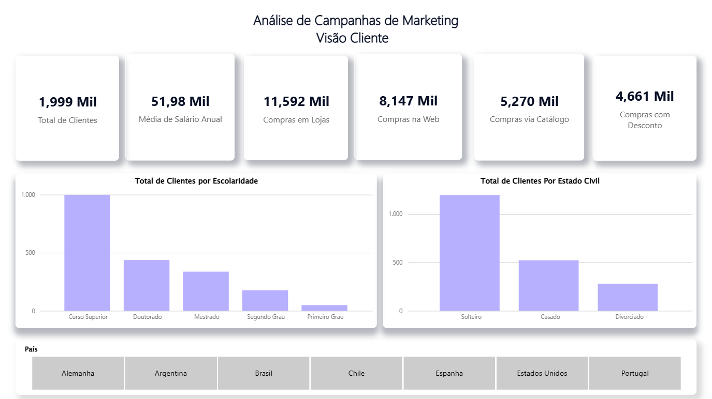
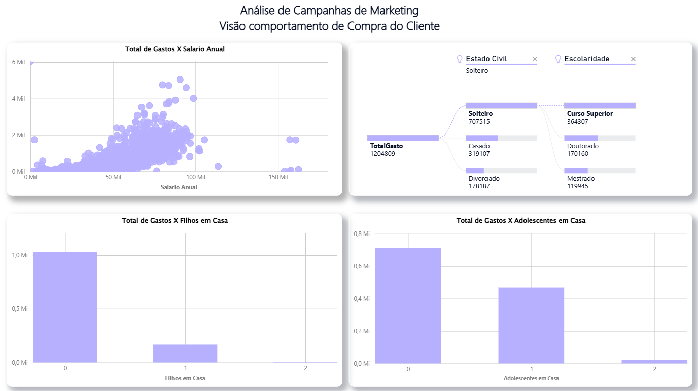
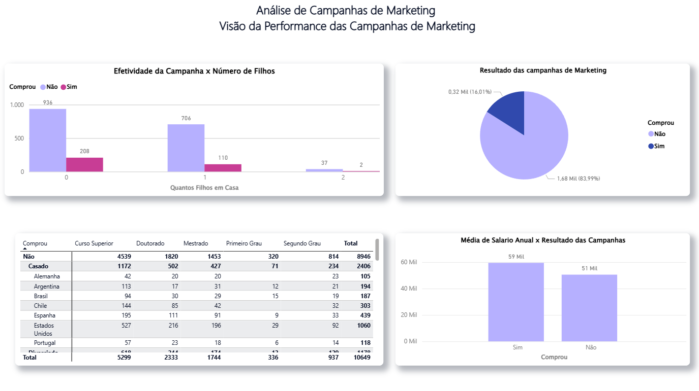
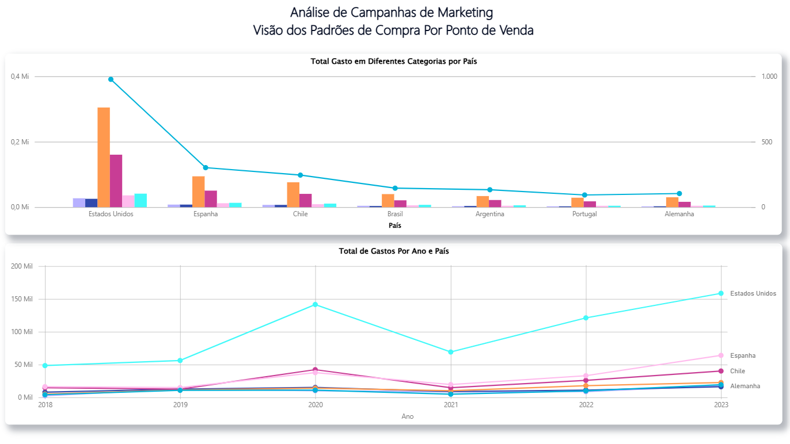

# Análise de Campanhas de Marketing | Power BI

Projeto desenvolvido durante o curso **Microsoft Power BI Para Business Intelligence e Data Science**, da Data Science Academy.

Neste projeto, trabalhei com uma base de dados de clientes e campanhas de Marketing, criando 4 dashboards para analisar diferentes perspectivas:

- **Perfil dos clientes**
- **Comportamento de compra**
- **Performance das campanhas de Marketing**
- **Padrões de compra por Ponto de Venda**

## O que foi desenvolvido

Durante o projeto, foram trabalhados recursos do Power BI como:

* Tratamento e correção dos dados
* Criação de medidas
* Criação e formatação de visuais
* Análise e cruzamento de diferentes informações
* Construção de dashboards interativos

## Dashboards

### Visão Cliente

### Visão Comportamento

### Visão Campanhas

### Visão Ponto de Venda

## Arquivo Power BI

O arquivo `.pbix` utilizado no projeto está disponível neste repositório para download.

[Baixar arquivo Power BI](./Marketing_Campaigns.pbix)

## Ferramentas

* Power BI
* Power Query
* DAX

## Curso

**Microsoft Power BI Para Business Intelligence e Data Science**
Data Science Academy
